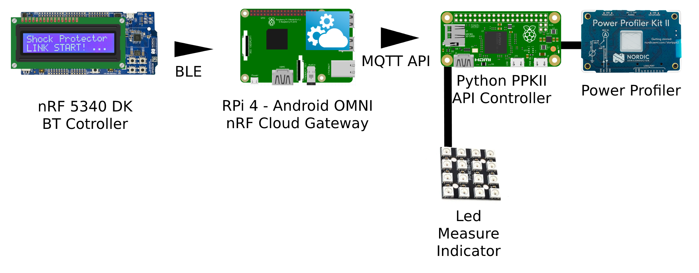
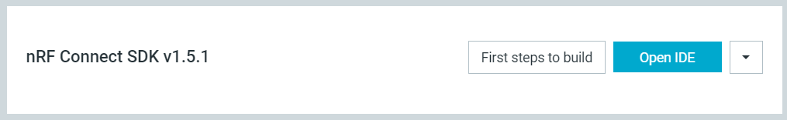
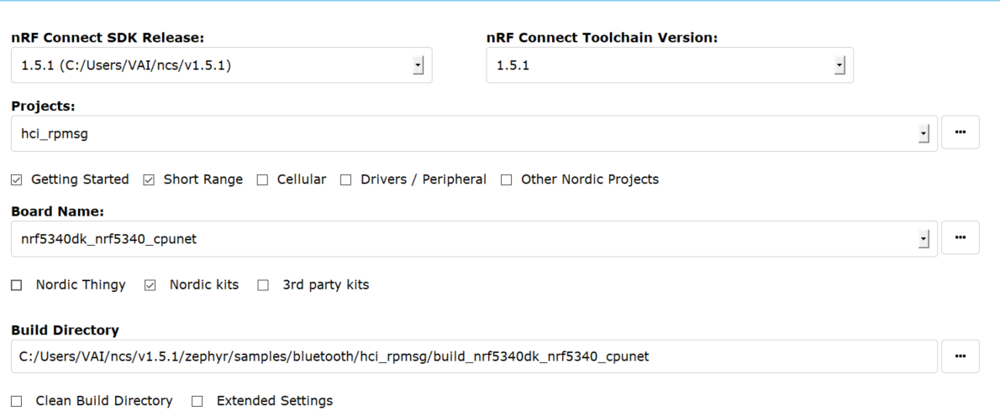
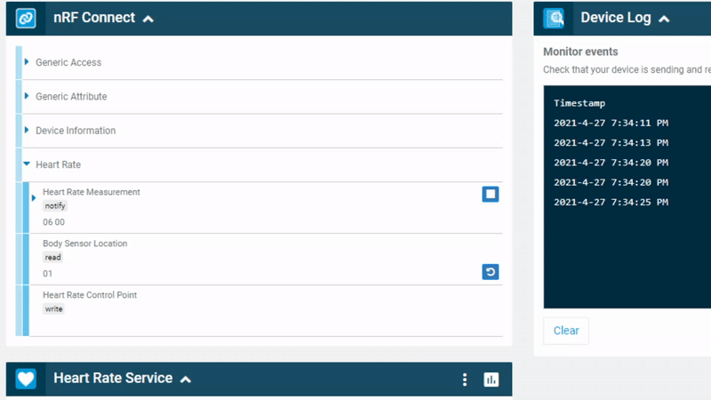
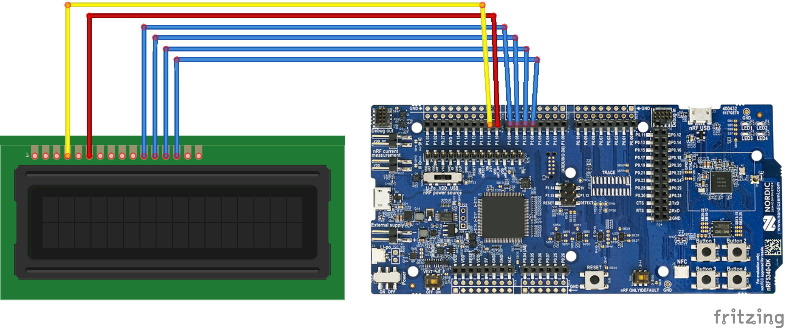
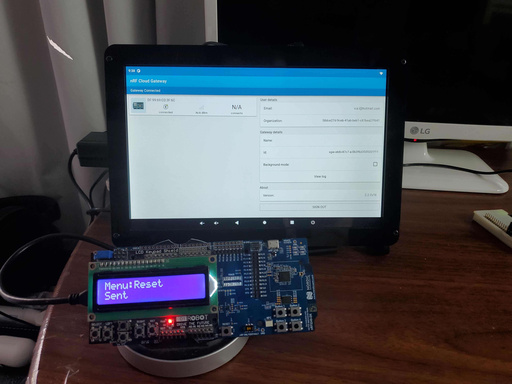
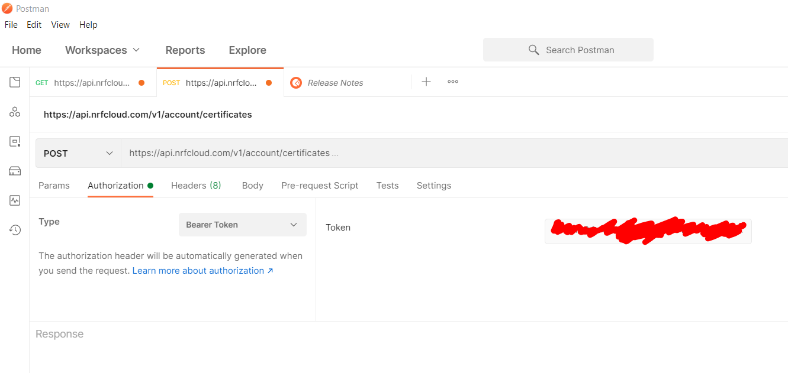
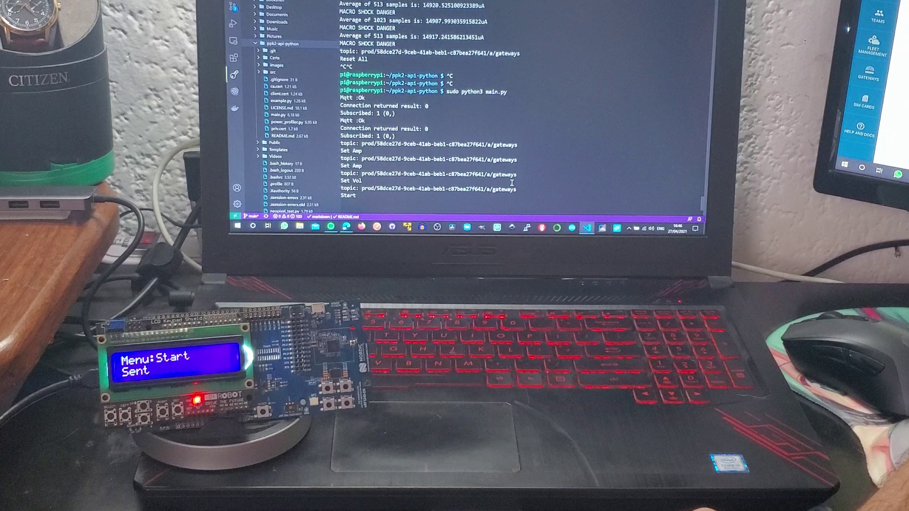
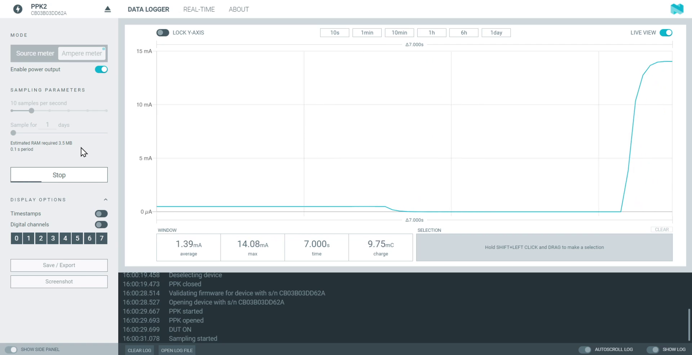

# Shock Protector
 System that is capable of monitoring the medical instruments or areas of contact with the patient.

# Table of contents

- [Shock Protector](#shock-protector)
- [Table of contents](#table-of-contents)
- [Introduction:](#introduction)
- [Solution:](#solution)
- [Materials:](#materials)
- [Connection Diagram:](#connection-diagram)
- [nRF5340 Setup:](#nrf5340-setup)
  - [Ble:](#ble)
  - [LCD:](#lcd)
  - [Buttons:](#buttons)
- [RPi Gateway Setup:](#rpi-gateway-setup)
- [RPi Zero Power Profiler Device Setup:](#rpi-zero-power-profiler-device-setup)
  - [Setup MQTT API:](#setup-mqtt-api)
  - [Setup PPK Python API:](#setup-ppk-python-api)
- [Test Metodolody:](#test-metodolody)
- [Laptop Test:](#laptop-test)
- [Bt Test:](#bt-test)
- [Full Test:](#full-test)
- [The Final Product:](#the-final-product)
    - [Epic DEMO:](#epic-demo)
- [Commentary:](#commentary)
  - [References:](#references)

# Introduction:

Nowadays, all electrical devices that we use, be it your cell phone charger to a washing machine, require to be connected to a 120-240 volt socket at 50-60 Hz. Even in the surgery rooms of hospitals the same thing happens. In the same way, every medical device is connected to a wall socket. However we have a very serious problem, if one of the devices is damaged and some of the current is transmitted to the human body it can be dangerous and even lethal .

This current that can reach the human body is known as a leakage current and depending on its intensity, it can injure or even kill the patient [1].

The most common case of these accidents is known as macro shock, which occurs when a current of more than 10mA passes through the human body.

Less common than the previous one, is a leakage current known as micro-shock. This occurs when a leakage current of at least 10uA reaches a person through a catheter to the heart.

I want to solve the problem of early detection of these leakage currents before they can cause harm to patients.

[1]. https://www.sciencedirect.com/topics/biochemistry-genetics-and-molecular-biology/macroshock

# Solution:

I build a system that is capable of monitoring the medical instruments or areas of contact with the patient to prevent the patient from receiving one of these shocks and, in the case of detecting these leakage currents, activate an alarm so that there is proper maintenance for the equipment or they can cancel their use.

Current Solutions:

Isolated Power System - Schneider:
https://www.se.com/ca/en/product-range-presentation/7367-isolated-power-system/
- It is to complex and expensive
- Has to be built inside the hospital’s infrastructure at the time of its construction
- Requires constant maintenance

Double insulation cables:
- These types of cables should be used in all medical equipment.
- You must follow the regulations not to use this cable for lengths greater than 36 meters.
- The cable must be placed in the entire electrical installation of the hospital from its construction.

The system that I am going to make is going to be plug and play, since it can be placed in any device that is going to be used with the patient before they come into contact with it in order to maintain the 10uA maximum current regulation leakage.

# Materials:

Hardware:
- nRF5340 DK                            x1.
https://www.nordicsemi.com/Software-and-tools/Development-Kits/nRF5340-DK
- 1602 LCD Keypad Shield For Arduino.   x1.
https://www.amazon.com/dp/B006D903KE/ref=cm_sw_em_r_mt_dp_CTDF7KGCKPRN9QMDETXT?_encoding=UTF8&psc=1
- Power Profiler Kit II.                x1.
https://www.nordicsemi.com/Software-and-tools/Development-Tools/Power-Profiler-Kit-2
- Rpi Zero W.                           x1.
https://www.amazon.com/dp/B07BHMRTTY/ref=cm_sw_em_r_mt_dp_9NRSPWM9RA6SGEH4BBS0
- 4x4 WS2812B NeoPixel                  x1.
https://www.aliexpress.com/i/32901162313.html
- Rpi 4.                                x1.
https://www.raspberrypi.org/products/raspberry-pi-4-model-b/

Software:
- nRF Connect:
https://www.nordicsemi.com/Software-and-tools/Development-Tools/nRF-Connect-for-desktop
- Python:
https://www.python.org/
- Segger Embedded Studio:
https://www.segger.com/products/development-tools/embedded-studio/
- nRF Cloud:
https://nrfcloud.com/
- OmniROM:
https://omnirom.org/

# Connection Diagram:

  **NOTA: La solucion se realizo utilizando el nRF5340 como control BT para aislar completamente al usuario de las mediciones de las corrientes de fuga del sistema.**

This is the connection diagram of the system:

# nRF5340 Setup:

Los codigos estaran en la carpeta "nRF Software"

Para programar el nRF5340, se utilizo Segger Embedded Studio instalado desde nRF Connect -> Toolchain Manager -> Segger Embedded Studio v1.5.1

En el caso del CORE NETWORK se utilizo la aplicacion de ejemplo "hci_rpmsg" sin realizan ningun cambio en esta.

En el CORE APPLICATION se realizo una aplicacion con las siguientes caracteristicas.

- Modulos Utilizados:
  - BLE.
  - LCD 16x2 Screen (4bits mode).
  - HW Buttons.

## Ble:

Para la utilizacion del BLE, se tomo como ejemplo el proyecto "peripheral_hr", utilizando su facilidad para mandar datos a nRF Cloud para mandar nuestros comandos.

En este caso el comando llega a travez de la Heart Rate Measurement como notificacion. Pueden ver como cambia de 0 a 4 indicando el comando que se requiera.

| Number | Command           |
|--------|-------------------|
| 00     | Start             |
| 01     | Stop              |
| 02     | Set Ampere Meter  |
| 03     | Set Source Meter  |
| 04     | Restart           |

Para mas detalles, el codigo dentro de la carpeta "nRF Software/cpuapp/main.c" tiene todos los detalles comentados.

## LCD:

La parte mas complicada de realizar una adaptacion de las librerias de LCD ya creadas para funcionar en los pines de la board, en este caso se utilizo un shield de Arduino para conectarlo a la board, el esquema de conexiones es el siguiente.

En el software se definieron de esta manera las conexiones.

| LCD PIN          | Board PIN |
|------------------|-----------|
| D4               | P1.06     |
| D5               | P1.07     |
| D6               | P1.08     |
| D7               | P1.09     |
| E                | P1.10     |
| RS               | P1.11     |
| Backlight shield | P1.12     |

Para mas detalles de como funciona la liberia, el codigo dentro de la carpeta "nRF Software/cpuapp/main.c" tiene todos los detalles comentados.

## Buttons:

La utilizacion de los botones se hizo mediante la tecnica de polling con debounce de 10ms.

    while (gpio_pin_get(button1, SW0_GPIO_PIN) == 1)
        {
            k_msleep(10);
            if (gpio_pin_get(button1, SW0_GPIO_PIN) == 1)
            {
                button = "1";
                flag = true;
            }
            if (gpio_pin_get(button1, SW0_GPIO_PIN) == 0)
            {
                k_msleep(10);
                if (gpio_pin_get(button1, SW0_GPIO_PIN) == 0)
                {
                    break;
                }
            }
        }

Todos los detalles estan comentados en el codigo "nRF Software/cpuapp/main.c"

# RPi Gateway Setup:

Para evitar el tener que tener un celular constantemente utilizando la nRF Cloud Gateway, decidi instalar un sistama operativo de Android en una RPi 4, con el fin de que sirviera como Gateway constante.

RPi Android OS: OmniROM
https://omnirom.org/

# RPi Zero Power Profiler Device Setup:

Para utilizar el power profiler, utilice una raspberry pi zero para realizar el control Serial del profiler y ademas poder recibir los comandos por la MQTT API de nRF Cloud.

## Setup MQTT API:

Para obtener las credenciales para utilizar el MQTT API de nRF segui los pasos de la siguiente documentacion oficial.

https://nrfcloud.com/#/docs/guides/mqtt

Para obtener todas las credenciales y certificados necesarios utilice el software Postman.

Para poder recibir los mensajes por MQTT utilice la libreria paho-mqtt, todo el codigo estara en la carpeta "PPK rpi".

Consideraciones importantes:

- Guardar los 3 certificados en la carpeta Certs.
- Escribir tu Endpoint correspondiente en el codigo main.py
- Escribir tu clientId correspondiente en el codigo main.py

        EndPoint = "XXXXXXXXXXXXXXX.iot.us-east-1.amazonaws.com"
        Client = "account-XXXXXXXX-XXXX-XXXX-XXXX-XXXXXXXXXXXX
        sub_topic = 'prod/XXXXXXXX-XXXX-XXXX-XXXX-XXXXXXXXXXXX/a/gateways'

## Setup PPK Python API:

Todo lo necesario para utilizar la API esta en la carpeta "PPK rpi".

Es necesario instalar las siguientes librerias en la RPi.

    pip3 install paho-mqtt adafruit-circuitpython-neopixel 

Para correr correctamente la gateway es necesario correr el programa con "sudo".

    sudo python3 main.py

Ejemplo de como recibe los mensajes el MQTT broker.

Video: Click on the image

# Test Metodolody:

Para este proyecto decidi probar el funcionamiento de el dispositivo en una situacion controlada donde las corrientes medidas fueran estandarizadas, en esta caso se utilizo la siguiente plataforma.

# Laptop Test:

Probando el power profiler con las resistencias, revisando que las mediciones sean las correctas en la aplicacion de nRF Power Profiles App.

Video: Click on the image

# Bt Test:

Revisando que la Raspberry Pi funcione correctamente como Gateway.

Video: Click on the image

# Full Test:

Aqui una prueba de todo el sistema funcionando al mismo tiempo.

Video: Click on the image

# The Final Product:

Product:

### Epic DEMO:

Video: Click on the image

# Commentary:

// Pending

## References:

Links:

[1]. https://www.sciencedirect.com/topics/biochemistry-genetics-and-molecular-biology/macroshock